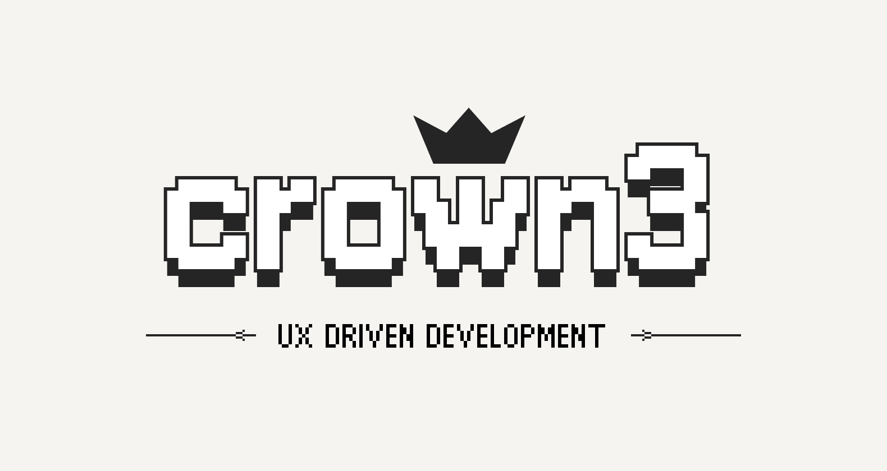

Visit [crown3.cc](https://crown3.cc)!

Hi, I am a **Frontend developer** and **Designer** who seeks for _UX-driven development_.

### Currently interested in...

- **Frontend Animations**
- **Making Vector Graphic Animations**
- **Pixel Graphic Designing**

### Stacks

For Frontend Development,

  

 

For Designing,

  

But I can also do,

 
